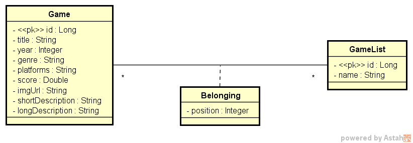

# DSL LIST
[](https://github.com/devsuperior/sds1-wmazoni/blob/master/LICENSE) 

# Sobre o projeto

Deploy Back end na nuvem : [https://dslist-production-5348.up.railway.app/]

DsList é uma aplicação back end construída durante a 2ª edição da **Semana DevSuperior** (#sds2), evento organizado pela [DevSuperior](https://devsuperior.com "Site da DevSuperior").

A aplicação consiste em uma lista de preferência de games, onde os dados são coletados no arquivo JSON, e depois são listados no banco de dados, que também podem ser realizadas alterações nas posições dos elementos.


## Modelo conceitual


# Tecnologias e ferramentas  utilizadas
## Back end
- Java
- Spring Boot
- JPA / Hibernate
- JDBC
- Maven
- Postman
- Docker

##Banco de dados: 
- H2 (Testes)
- Postgresql

## Deploy: 
- Railway


# Como executar o projeto

## Back end
Pré-requisitos: Java 11

```bash
# clonar repositório
git clone https://github.com/devsuperior/sds1-wmazoni](https://github.com/vhraposo/dslist)

# entrar na pasta do projeto back end
cd dslist

# executar o projeto
./mvnw spring-boot:run
```


# Autor

Victor Raposo

https://www.linkedin.com/in/vhraposo/

